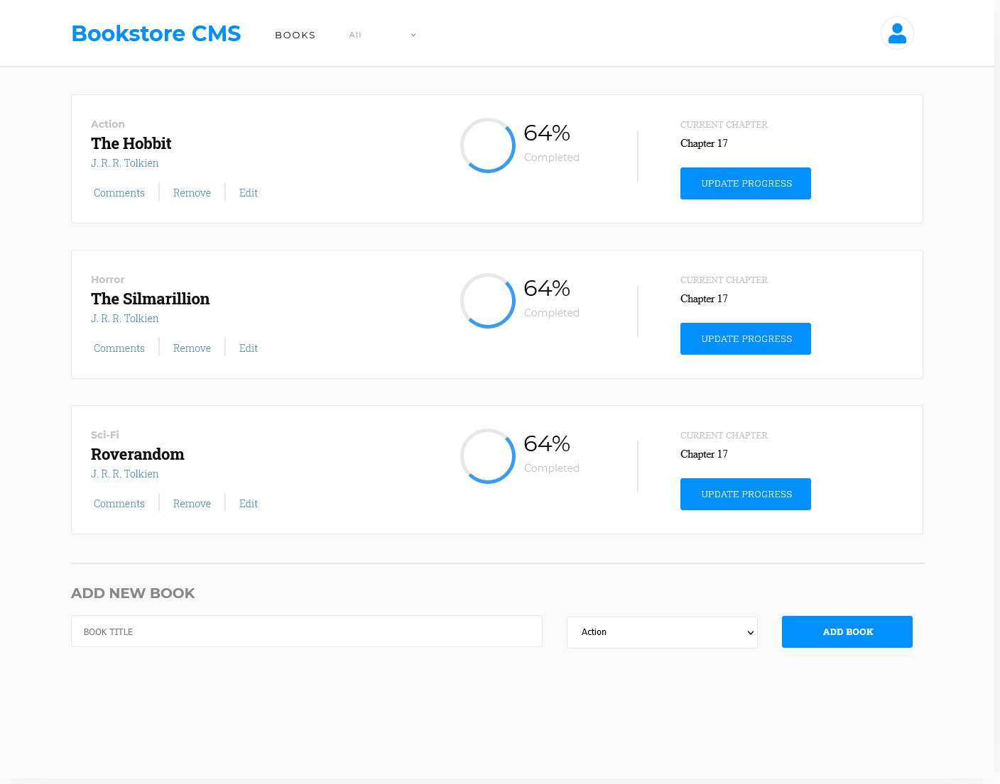

# Bookstore App

> Small Bookstore built with React & Redux.

A Bookstore App where is possible to catalogue books.
So far is possible to add a new book via the submit Button on the form,
and to remove a book from the app via the Remove button on the Book.

## Built With

- HTML, CSS and JavaScript
- React and Redux
- Node.js, eslint and stylelint

## Live Demo

[Bookstore](https://bookstore-app-jpdf.herokuapp.com/)

## Getting Started

To get a local copy up and running follow these simple example steps.

- On the top of the page there is a green button name "Code"
- Click on the "Code" button.
- A Menu will appear click in "Download Zip"
- Save the zip file on your computer.
- Extract the contents of the zip you just downloaded into a folder.

### Prerequisites

- nodeJS.
- A browser.

### Setup

- Open your comand prompt.
- Go inside the folder you extracted from the zip file.
- Type `npm install`.

### Usage

- Open your comand prompt.
- Go inside the folder you extracted from the zip file.
- Type `npm start` (this should open a page in your default browser and the page should load).

## Authors

👤 **João Paulo Dias França**

- GitHub: [@jpdf00](https://github.com/jpdf00)
- Twitter: [@jpdf00](https://twitter.com/jpdf00)
- LinkedIn: [João Paulo Dias França](https://www.linkedin.com/in/jpdf00/)

## 🤝 Contributing

Contributions, issues, and feature requests are welcome!

Feel free to check the [issues page](https://github.com/jpdf00/bookstore-app/issues).

## Show your support

Give a ⭐️ if you like this project!

## Acknowledgments

- User Icon courtesy of [Font Awesome](https://fontawesome.com/v5.15/icons/user?style=solid) under the [Font Awesome Pro License](https://fontawesome.com/license)

## 📝 License

This project is [MIT](./LICENSE) licensed.
